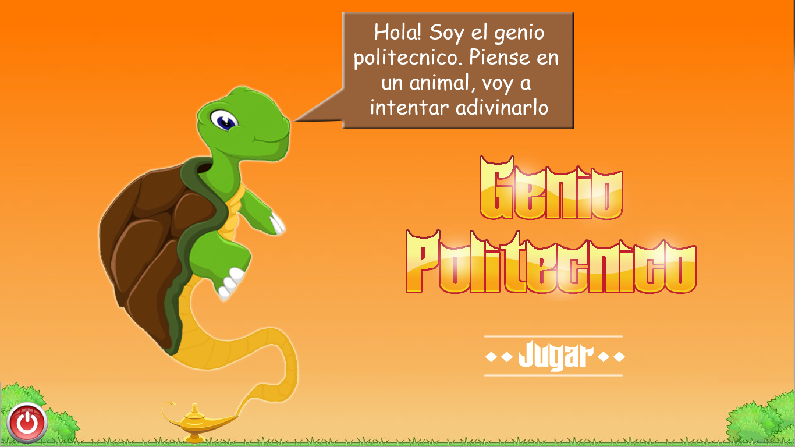
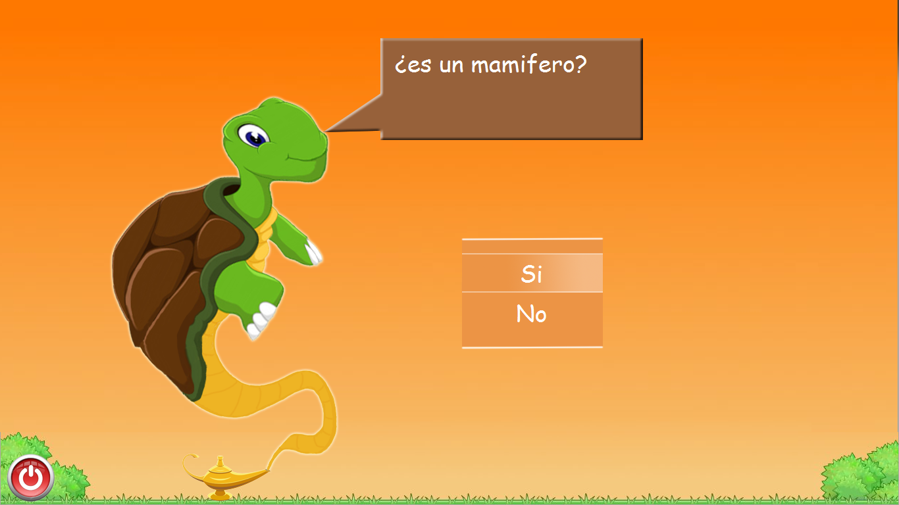
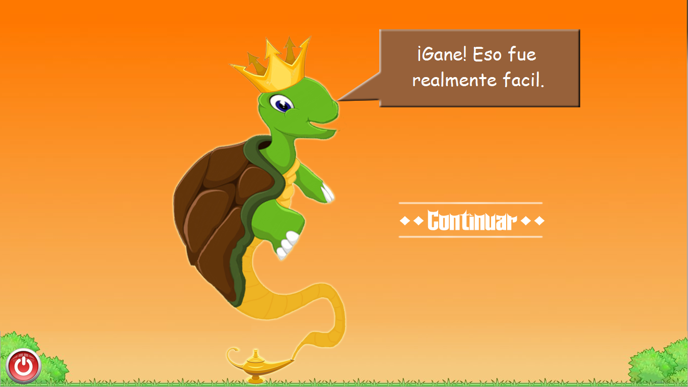
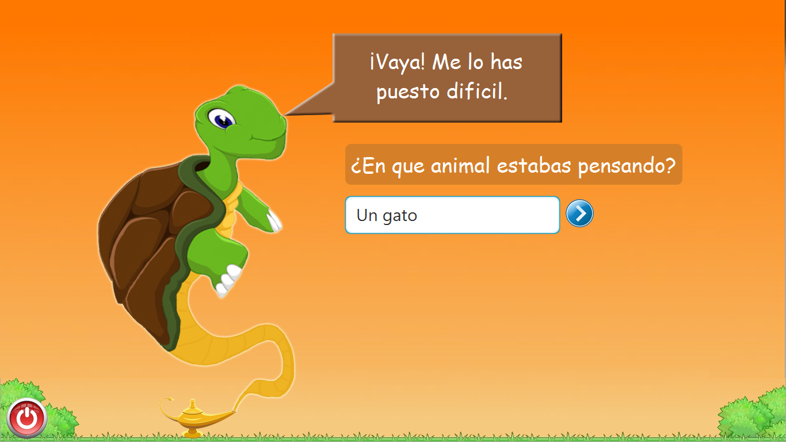
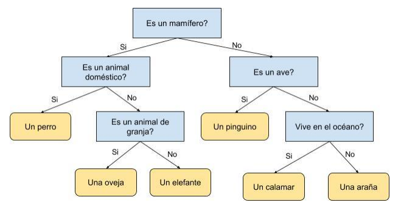

<div align='center'></div>

[![language][language-shield]][language-url]
[![Codacy Badge][codacybadge-shield]][codacybadge-url]
[![repoSize][repoSize-shield]][repo]
[![Contributors][contributors-shield]][contributors-url]
[![forks][forks-shield]][forks-url]
[![Stargazers][stars-shield]][stars-url]
[![Issues][issues-shield]][issues-url]
[![lastCommit][lastCommit-shield]][lastCommit-url]
[![LinkedIn][linkedin-shield]][linkedin-url]
[![Twitter][twitter-shield]][twitter-url]


# Genio Politecnico

 

**Genio Politecnico** is a game based on Akinator, that aims guess the animal the player is thinking, using a desicion tree that the player feeds while it is playing the game.

## The game 🎮

If you have played Akinator before you already know how **GenioPolitecnico** works.
However, since the aim of **GenioPolitecnico** is guess the animal you are thinking, he will ask you some questions about the animal that gives him enough information to try to guess the animal you are thinking. He will ask as many questions as be necessary to guess.



When he has an answer he will ask you whether the animal he guessed is the same to the animal that you were thinking.

It can be either, he guessed successfully the animal and therefore he will be really happy for that.



Or he missed and will feel so sad because the animal that he guessed is not the same to the animal you were thinking. In that case, **GenioPolitecnico** will ask you what is the animal you were thinking and will ask some information that allows him to differentiate between the animal he guessed with the correct animal. This is the way how he will learn about more and more animals.



## Behind the Scenes 🔥
The game make use of a decision tree to model the game, where the nodes are the questions, and the answers indicate de direction to follow in the tree. The internal nodes model the questions, and the leafs model the answers.

<div align='center'></div>

The game starts at the root of the tree, and this descend through the tree while the player answers to the questions, when it gets to a leaf, the animal in that leaf is the animal wich **GenioPolitecnico** guessed. If the missed the answer, he will ask more information about the real animal the player was thinking, and the game will add it to the tree, the more you play, the more animals he will learn about, and most robust will be the tree.

## Prerequisites 📋
You should have the java virtual machine installed(JVM) on your computer to run the game, if you do not have the java virtual machine you could install it from [here](https://www.java.com/es/download/)

### Installation 🔧
You only need to download this project.
To run the game you need to get into the folder "dist", which is in the root directory, and then execute the "GenioPolitecnico.jar" file.

Or you can also run this from the shell, you need to cd to the project folder, and then execute:
```
java -jar dist/GenioPolitecnico.jar
```

## Built with 🛠️
* Java8
* JavaFx
* JavaFx.Animation
* Photoshop


[language-shield]: https://img.shields.io/badge/Java-v1.8.0-blue?style=plastic
[language-url]: https://www.java.com/es/download/
[codacybadge-shield]: https://img.shields.io/codacy/grade/9e4896b64d2b4bc5984c6f9b774096a4?style=plastic
[codacybadge-url]: https://www.codacy.com/manual/AlexVelezLl/GenioPolitecnico?utm_source=github.com&amp;utm_medium=referral&amp;utm_content=AlexVelezLl/GenioPolitecnico&amp;utm_campaign=Badge_Grade
[repoSize-shield]: https://img.shields.io/github/repo-size/AlexVelezLl/GenioPolitecnico?style=plastic
[repo]: https://github.com/AlexVelezLl/GenioPolitecnico
[contributors-shield]: https://img.shields.io/github/contributors/AlexVelezLl/GenioPolitecnico?style=plastic
[contributors-url]: https://github.com/AlexVelezLl/GenioPolitecnico/graphs/contributors
[forks-shield]: https://img.shields.io/github/forks/AlexVelezLl/GenioPolitecnico?style=plastic
[forks-url]: https://github.com/AlexVelezLl/GenioPolitecnico/network/members
[stars-shield]: https://img.shields.io/github/stars/AlexVelezLl/GenioPolitecnico?style=plastic
[stars-url]: https://github.com/AlexVelezLl/GenioPolitecnico/stargazers
[issues-shield]: https://img.shields.io/github/issues/AlexVelezLl/GenioPolitecnico?style=plastic
[issues-url]: https://github.com/AlexVelezLl/GenioPolitecnico/issues
[lastCommit-shield]: https://img.shields.io/github/last-commit/AlexVelezLl/GenioPolitecnico?style=plastic
[lastCommit-url]: https://github.com/AlexVelezLl/GenioPolitecnico/commits
[linkedin-shield]: https://img.shields.io/badge/-LinkedIn-black.svg?style=plastic&logo=linkedin&colorB=555
[linkedin-url]:https://www.linkedin.com/in/alex-velez-llaque-4b3327191/
[twitter-shield]:https://img.shields.io/twitter/follow/AlexVelezLl?label=Follow&style=social
[twitter-url]:https://twitter.com/AlexVelezLl
